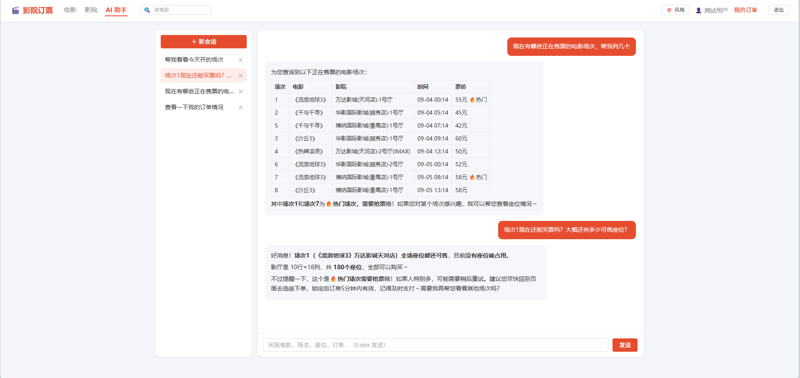

# Cinema Ticketing · 影院在线订票系统

<div align="center"> <p>        </p> </div>





这是我学习了黑马点评之后，根据自己对并发和架构设计的理解而在新的业务场景下的知识应用


一个前后端分离的影院在线购票系统：用户浏览影片、影院与场次 → 实时选座锁座下单 → 支付/退票 → 订单闭环，并内置一个基于大模型的 AI 购票助手做会话式查询。

---

## 我在新的业务场景上，着重考虑了这些问题（讲解完业务核心流程后，下面的问题会逐一得到解答）：


lua脚本执行一半Redis宕机了怎么办？Redis数据丢失了怎么办？下方贰\-4解决

lua脚本执行完了，要同步给数据库时后端崩了，没发同步请求咋办？下方贰\-4解决

离散的座位不同于聚合的优惠券秒杀，数据结构如何设计？下方贰\-1解决

用户如果直接越过抢座界面直接占用几个座位发下单请求支付请求怎么办？下方贰\-9解决

流量突发时，如何进行限流？下方壹\-9解决


### 此外，我们还新增了AI模块

基于 SSE 实现 AI 对话流式输出，缓解大模型响应延迟带来的体验问题

实现AI的会话上下文 Redis\(30min 活跃\) \+ DB\(永久存档\) 双存储。

使用RAG 向量检索购票/退改规则等常见问题 FAQ，增强AI的回答。


## 购票业务流程介绍:

用户一次下单的完整流程：

1. 进入首页


2. 选择电影和场次


3. 进入抢座界面抢座


4. 订单支付


### 一些额外的业务规则：

选择座位后点击确认选座并支付按钮后座位会进入锁定状态。

如果5分钟不下单订单就会超时，座位也会被释放。

选座位的时候如果有人锁住了座位，那么那几个座位就会同步变灰，我们就选不了了。

其实不是所有人都能进入抢座界面，假设抢票实在是太火爆了，所以设置了资格制，也就是不是所有人按了抢票按钮都能进入抢座界面，我目前设置的资格是座位数的3倍，也就是说点击抢票按钮其实是对资格的秒杀，秒杀到了资格才能进选座界面，否则就会提示当前人数过多，服务器繁忙请稍后重试。


这就是我们的核心业务部分了。


# 具体实现和思路思考及方案权衡：

### 上述步骤拆解：

1. 第一步，用户并发抢进入抢座界面的资格

2. 第二步，用户并发抢购和锁定座位

3. 第三步，锁定座位后的订单状态流转


**看样子很简单，但其中涉及到的问题很多。**

第一步里面，用户并发抢进入抢座界面的资格，这个进入页面的资格怎么设计？怎么管理？既然限额了那额度怎么回流，什么时候回流？具体怎么实现？

第二步里面，用户并发抢购和锁定座位，那这个场次的座位图用什么数据结构？如果redis宕机了怎么办？锁定座位怎么同步显示在前端上面？

第三步里面，用户锁定座位之后，前面的资格怎么回流？如果用户取消订单，前面的座位又怎么变回空座位？


## 壹\-\-用户并发抢进入抢座界面的限流资格：

第一步我们要对进入抢座界面的人数进行一个限制，所以设置了一个抢资格的规则。实质上是对资格这个名额进行秒杀操作，然后防止资格的超卖，资格有时间限制，也要注意资格在用户完成支付之后回流。

### 方案：Redis ZSet 资格闸门 \+ Lua 原子扣减

采用Redis来抗并发，使用ZSet的数据结构来存储用户资格，key是场次，ZSet的元素是用户id，分数是到期时间。用户来抢资格的链路就是：一个个请求用lua脚本来抢资格，lua脚本里面先删除ZSet中过期的元素（相当于时刻维护时间过期的资格），然后判断这个用户是否已经有资格了，有资格就返回，没有资格了就判断是否还有剩余资格，没有了就返回服务器繁忙，还有的话就把用户相关信息加入到Zset里面。


### 为什么用ZSet？ZSet方案和原始方案对比：

### 原始方案：string key\+Set \+ 延迟队列回流资格:

最开始我想到的方案：一个string的key负责记录剩余资格数，然后用Set来记录抢到资格的用户（有点像黑马点评的秒杀优惠券的方案，然后再加上延迟队列），然后用3min的延迟队列来负责在资格到期的时候增加剩余资格和从Set中删除过期资格用户。

### 两个方案对比：

#### 数据结构上：

直接就一个数据结构就可以记录资格数量是多少了，同时这一个数据结构还能同时记录用户是谁，什么时候到期（放分数里面还能排序），只用一个数据结构就完成了到期记录，记录数量，记录用户的任务。

#### 操作复杂度上：

同时也不需要再使用消息队列来处理资格回流了，不需要对资格\+1\-1这种操作了，因为删元素和增加元素天然就更改了ZSet记录的用户数量。而对于到期用户，ZSet也不需要专门计时间删除，只要有一个新的用户要进抢座界面触发抢资格的lua，就会先删过期用户再获取资格，如果没有用户访问，也不需要专门删除过期的那些资格，这样一来也节省了计算资源。

### 最终对比结论：

这里采用ZSet是十分合适的。ZSet一个数据结构就记录了所有需要的字段，且操作复杂度更低，实现相同功能的前提下方案更轻。


### 第二步引子:

ok，经过第一步，我们相当于把有资格的用户记录在ZSet里面了，接下来有资格的用户就可以进入到抢座界面了。

## 贰\-\-用户并发抢购和锁定座位：

### 思考过程与问题拆解：

这一步要考虑的东西很多很多

1. 座位表我们该采用什么样的数据结构来存储呢\(**数据结构问题**\)

2. 用户一次会锁 1\~5 个座，和别人同时下单的并发问题（**原子锁座问题**）

3. 同一个用户，不能同时有多笔进行中的订单，不能一个人几次操作锁了几十个座位（**一人一单问题**）

4. 如果redis宕机了怎么办？redis的lua脚本执行一半崩了咋办？或者是执行了lua脚本但是请求线程崩了出异常了没执行落库语句咋办？（**数据安全问题**）

5. 落库要是写失败了咋办？Redis里已锁的座位还要还回去的\(**redis脏数据问题**\)

6. 5分钟不支付，订单和座位要能自动释放\(**订单超时释放问题**\)

7. 同场次其他人要同步看到这个座被占了，不然一直不更新座位图那选座就成开盲盒了\(**实时可见问题**\)

8. 用户5分钟时才支付，订单成功支付的落库请求正好和订单过期的延迟消息撞一起了咋办？\(**支付过期冲突问题**\)

9. 有人直接跨过锁座界面，想直接发请求下单咋办？或者用户取消别人的订单咋办？（**越界访问问题**）


### 问题解决与思考：

### 1：数据结构问题:

其实我们用一个hash结构即可解决，字段名是座位，字段值是0或者用户id，值为0表示该座位没被锁，值为id表示锁该座位的用户id是xxx。

### 2和3：原子锁座问题和一人一单问题：

我们采用lua脚本去原子操作就行了，把判断座位是否被锁，判断用户是否已经锁过座位（第二步我们对每个用户和对应场次设一个用户锁）的逻辑集中到lua脚本中就完事了。

### 4\.数据安全问题：

### 最终方案：DB 真源 \+ 可重建缓存

我这里采取的方案是以落到数据库的数据为准，redis中的数据可以从数据库重建。

### 方案具体形式：

1\.我们在lua脚本执行完之后，如果占座成功，则直接把进行中的订单落库处理，这样就直接同步订单信息到数据库了。然后支付请求是数据库乐观锁更改数据库中的订单状态，而不经过redis。

2\.有了同步落库之后，我们可以从数据库中已经记录的进行中的订单和已支付的订单还原出场次座位信息（而不用担心还有的落库请求在消息队列里还未处理）。由上可知如果redis崩了，那么我们可以重建座位图，甚至仍然可以支付订单并且成功。

### 疑点1：直接同步数据库？那缓存的意义？

如果我缓存执行完了又同步数据库，那我缓存的意义在哪里呢？是不是还不如直接操作数据库？

### 疑点1解答：redis提供便于直接查询的数据结构，减少数据库全表查询请求

redis的作用是用于提供一个已建立的座位的数据结构用于给大量读请求返回结果。而不是让读请求和写请求都跑到数据库去查和改，读请求是全表查询，不能有那么多全表查询的，而且全表查询还会干扰写请求。

### 疑点2：请求都要打库，数据库的压力不就很大？

### 疑点2解答与方案对比：

实际上只有获取到资格且lua脚本成功占座的人才能触发数据库同步，而获取到资格的人可能就几百个，抢座请求执行成功的就更少了，肯定小于该场次座位数，实际上真正打库的请求并不会很多，所以数据库不至于扛不住。

### 为何不采用 redisTTL过期key记录订单状态\+消息队列异步落库 方案？

我们在这里不用异步落库的方式的原因主要是为了防止在缓存重建时还有的落库请求在消息队列里还未处理，相当于我们是为了数据安全性而考虑，因而放弃了消息队列异步落库的方案。仅仅只使用消息队列的延迟队列做订单过期处理

订单状态用redis的TTL过期看似就可以不使用延迟消息了，但是问题是这里订单过期必须是一个主动过程，订单过期之后，用户锁的座位要失效，用TTL过期是没办法主动提醒的。而且这样会导致更新订单状态等操作先在redis操作（因为只有操作的是不过期的key才算在订单到期前完成支付），那相当于导致数据真源位于redis，而redis是不可靠的，如果用户支付成功lua脚本执行到一半崩溃或redis宕机，无法发送落库请求，那么就会造成资产损失。

### 疑点3：lua脚本执行失败和后端服务崩溃如何解决？

lua脚本执行到一半崩了（修改已经生效），或者lua执行完成但是请求线程崩了出异常了没执行落库语句，就会出现有座位在redis已锁，用户没法选那些“已锁”座位，导致一部分座位卖不出去。

### 疑点3解决方案：缓存重建基础上设置过期时间

那么我们对整个座位图hash结构设置一个过期时间（由于是低概率问题所以我们设置为5小时一次），这样通过过期和查询重建的方式保持座位表和数据库定期同步，我们就可以解决这个问题了。

### 重建思想总结：

其实redis宕机的解决核心就是类似于undolog和redolog的对账思路，通过查看redis的数据和数据库的记录的数据的差异去决定是重做还是回滚。我们在这里应用了简化的思路，我们以数据库的记录作为数据真源，以成功落库的数据为准，若redis有数据而db没数据则回滚。

### 5\.redis脏数据问题:

落库要是写失败了咋办？Redis里已锁的座位还要还回去的

### 解决：try\-catch解决，异常则redis操作回退

我们在业务代码中用try\-catch解决就行，落库操作放try里面，catch到相关异常就把redis已经执行的操作回退即可

### 6\.订单超时释放问题:

5分钟不支付，订单和座位要能自动释放

### 方案：使用消息队列的延迟队列来解决。

### 疑点：为何前面资格超时不用消息队列，这里订单超时要用消息队列了呢？

### 方案对比与疑点解决：

前面资格超时使用ZSet就能完美解决，使用理由已经写的很详尽了。而这边为何要用消息队列呢？前面用户资格的过期其实是可以懒删除的，因为只要没人来抢座，那资格不过期也不影响。而订单超时是一个严格的过程，超过5分钟了订单就必须超时取消，不可再支付，因此我们需要通过消息队列来及时主动对过期的订单操作，像redis里面的ttl过期是懒删除的，并不能主动提醒过期。因此我们这里订单超时要使用消息队列来完成。

### 最终结论：延迟队列为主动提醒，Redis过期为懒删除

### 7\.实时可见问题:

同场次其他人要同步看到这个座被占了，不然一直不更新座位图那选座就成开盲盒了?

### 解决方案：SSE实时更新选座界面

这里我使用的是SSE，有人锁座位的时候，服务器主动向订阅的用户（也就是该场次的用户）推送通知就行了，用户前端实时更新锁定的座位。而用户是不需要主动向服务器发送通知的，用户锁座位了自动触发推送即可。

### 8\.支付过期冲突问题:

用户5分钟时才支付，订单成功支付的落库请求正好和订单过期的延迟消息撞一起了咋办？

### 解决方案：数据库乐观锁

在这里我们用数据库的乐观锁即可解决，也就是支付成功的落库请求带where查询，必须操作的是未支付的订单，而不是已经取消的订单。如果支付落库不成功，执行后续退款逻辑即可。

### 9\.越界访问问题：

用户直接发请求下单？用户取消别人的订单？

### 方案：不信任请求中的用户id，用户id仅从登录态信息中获取

我们获取用户id从threadlocal获取，因此用户必须得是登录状态，而一旦是登录状态，那么ZSet里面肯定存有用户的资格信息，我们在下单lua脚本里面校验是否有资格即可。

#### 越界操作1：用户想直接发起支付请求

#### 解析：订单创建逻辑依赖前序选座确认步骤

如果用户想直接发起支付请求就更不可能了，因为只有下单请求执行了才会在数据库创建订单，直接发起支付不可能查询得到用户订单信息。

#### 越界操作2：用户取消别人的订单

#### 解析：用户id仅从登录态信息中获取

同样，获取用户id我们从threadlocal中获取而非用户请求中获取，那么发起的数据库修改操作不可能修改的是别人id的订单。

### 最终结论：用户id仅从登录态信息中获取\+前序步骤资格检查即可解决越界访问问题


## 用户并发抢购和锁定座位总体流程大总结：

采用带过期时间的hash结构存储座位图，用户并发抢座我们采用lua脚本对hash座位表进行操作，lua脚本占座成功了就同步更新数据库，并且发送消息到延迟队列5分钟后过期。


## 叁\-\-锁定座位后的订单状态流转

### 解析:

其实这里也并不复杂，如果用户成功支付，那么抢座界面的资格回流，订单状态修改为成功支付即可。如果用户取消订单或者订单超时，那么到座位图里面更改座位占用状态，并且删除一人一单对应的用户锁即可。

### 最终结论：支付成功回流资格\+数据库乐观锁更改订单状态，支付失败/超时则数据库乐观锁更改订单状态\+释放座位\+删除一人一单用户锁


## 项目更多详细信息介绍

### 技术栈

|端|技术|说明|
|---|---|---|
|前端|Vue 3 · Vite · Element Plus · Pinia · Vue Router · axios|SeatMap 可视化选座、Chat 聊天页等 10 个视图|
|后端|Java 17 · Spring Boot 3\.3\.5|MyBatis\-Plus 3\.5\.7、Spring Data Redis、Spring AMQP、AOP、Validation|
|中间件|MySQL · Redis · RabbitMQ|MySQL 存权威业务；Redis 存会话/资格/座位/限流；RabbitMQ 做延迟关单|
|大模型|LangChain4j 1\.16\.2 · DeepSeek\(deepseek\-chat\)|OpenAI 兼容协议 \+ 工具调用 \+ SSE 流式|
|工具库|Hutool · Guava\(令牌桶\) · Lombok||

### 目录结构

```Plain Text
cinema-ticketing/
├── server/                        # Spring Boot 后端 :8081
│   └── src/main/
│       ├── java/com/cinema/
│       │   ├── controller/        # REST / SSE(movie·cinema·session·seckill·order·chat)
│       │   ├── service/           # 业务:订单状态机 / 抢资格 / 锁座
│       │   ├── chat/              # AI: CinemaAssistant + @Tool(场次/座位/订单)
│       │   ├── config/            # MyBatis-Plus / RabbitMQ(DLX) / Bloom 预热 / LangChain4j
│       │   ├── aspect/            # @RateLimit 二级限流切面
│       │   ├── mq/                # MqDelaySender
│       │   ├── consumer/          # OrderTimeoutConsumer(超时关单)
│       │   └── utils/             # RedisConstants / CacheClient / BloomFilter / UserHolder
│       └── resources/
│           ├── db/                # schema.sql + seed.sql
│           ├── lua/               # lockseat / releaseSeats / qualify / slidingwindow
│           └── prompts/           # assistant-system.txt
└── frontend/                      # Vue 3 + Vite :5173
    └── src/  views(Home/SeatSelect/Chat…) · components(SeatMap) · api · router · stores
```

### 快速开始

**环境**：JDK 17\+ · Maven · MySQL 8 · Redis · RabbitMQ · Node\.js 20\+

1. 启动 MySQL/Redis/RabbitMQ。

2. 建库建表 \+ 导演示数据（在项目根目录）：

```Plain Text
mysql -uroot -p < server/src/main/resources/db/schema.sql
mysql -uroot -p < server/src/main/resources/db/seed.sql
```

3. 填 server/src/main/resources/application\.yaml 里的连接信息（见下表）。

4. 起后端 mvn \-f server/pom\.xml spring\-boot:run（:8081）。

5. 起前端 cd frontend \&\& npm install \&\& npm run dev，访问 [http://localhost:5173](http://localhost:5173)。

6. 可选：填 cinema\.deepseek\.api\-key 后重启，启用 AI 助手。

> 登录验证码是**模拟发送**的——点发送后看后端控制台的 \[模拟短信\] 日志，复制 6 位验证码即可登录（任意未注册手机号自动注册）。
> 
> 

### 配置项（application\.yaml 需自行填写）

|配置项|说明|
|---|---|
|spring\.datasource\.url / username / password|MySQL（库名 cinema\_ticketing）|
|spring\.data\.redis\.host / port / database|Redis 连接|
|spring\.rabbitmq\.host / port / username / password|RabbitMQ 连接|
|cinema\.deepseek\.api\-key|DeepSeek Key（不填不影响其它功能）|

### 数据库（9 张表，db/schema\.sql）

tb\_user 用户 · tb\_cinema 影院 · tb\_hall 影厅\(行列布局\) · tb\_movie 电影 · tb\_session 场次\(票价/开售/热门标记\) · tb\_order 订单\(0待付/1已付/2取消/3退款\) · tb\_order\_seat 订单座位\(Redis 座位状态的对账依据\) · tb\_chat\_conversation AI 会话 · tb\_chat\_message AI 消息

