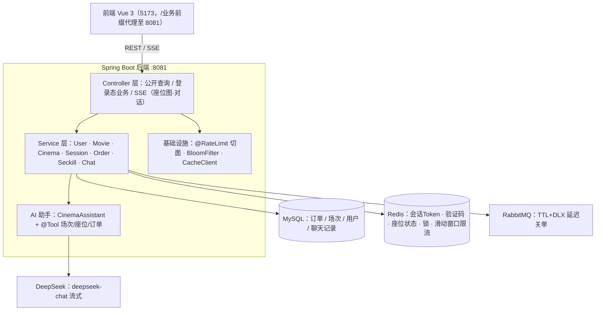
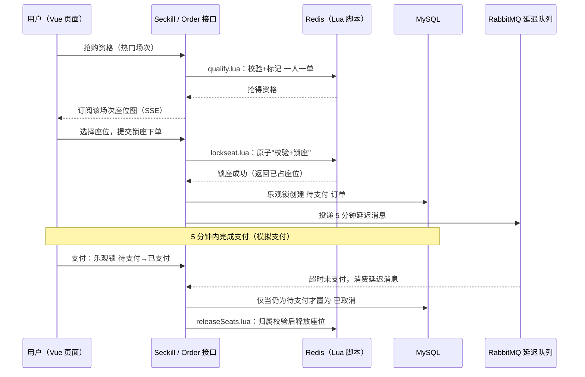
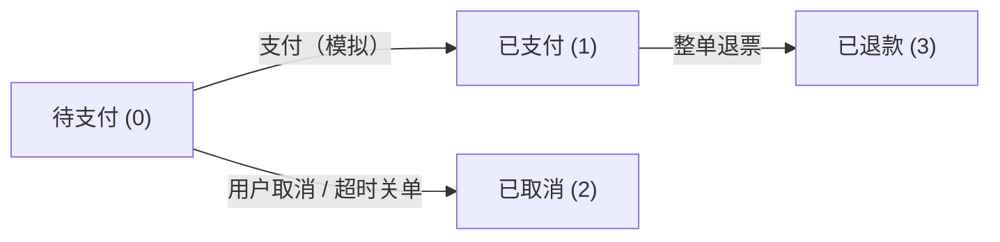
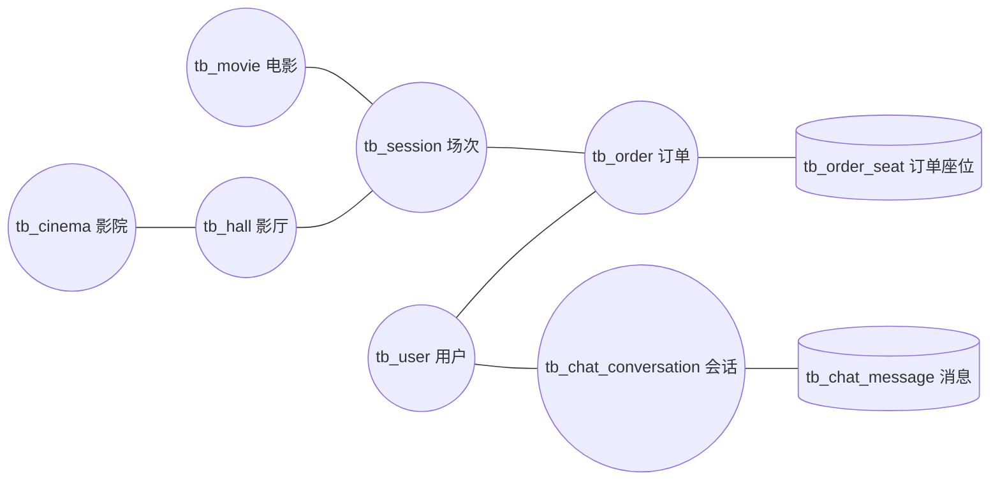

# Cinema Ticketing · 影院在线订票系统

一个前后端分离的影院在线购票系统：用户浏览影片、影院与场次 → 实时选座锁座下单 → 支付/退票 → 订单闭环，并内置一个基于大模型的 AI 购票助手做会话式查询。后端在真实中间件上自研了 Redis Lua 原子抢座、RabbitMQ 延迟关单、二级限流、布隆过滤等机制，强调"每个方案都有取舍依据"，而非只堆框架。

---

## Introduction

系统覆盖完整的购票链路与售后链路，并把 AI 对话自然地嵌进购票场景：

- **浏览层**：热映影片、影院、影厅与场次的检索与详情，按开售/热度状态区分可购场次。
- **交易层**：影厅按"行 × 列"生成可视化座位图；热门场次先抢资格（一人一单）再选座，普通场次直接锁座下单；订单 5 分钟内支付有效，超时自动关单释放座位。
- **售后层**：模拟支付、主动取消、整单退票，订单状态机由乐观锁保证并发安全。
- **智能层**：DeepSeek 驱动的"影院小助手"——用工具调用实时查场次、座位占用、当前用户订单，再以自然语言流式回答（SSE 打字机输出），只做查询与引导、不越权操作。

项目为单机可完整演示，业务边界清晰，所有对外能力均通过 REST/SSE 接口提供。

## Features

**用户与会话**

- 手机号 + 验证码登录 / 密码登录（BCrypt），首次验证码登录自动注册
- 登录态基于 **Redis 会话 Token**（UUID → 缓存用户信息），退出即失效；请求通过拦截器校验并注入当前用户（`ThreadLocal`），订单类接口全部从上下文取 `userId`，从源头杜绝越权
- 验证码为模拟发送：6 位随机码写入 Redis（含 TTL），以控制台日志代替真实短信网关

**影片 / 影院 / 场次**

- 影片、影院、场次列表与详情查询，含热门场次标记、开售时间控制
- 详情类查询叠加缓存防护：启动时把合法主键灌入**布隆过滤器**拦截非法请求（防穿透），`CacheClient` 用 Redis `setIfAbsent` 互斥锁重建缓存（防击穿）

**选座与抢票**

- 影厅座位不落库：以 `row_count × col_count` 定义布局，实际占用状态以**场次为维度实时存于 Redis**，订单座位表仅作对账依据
- 普通场次直接选座；热门场次先走抢资格接口（一人一单），座位图通过 **SSE** 向在线用户推送可选/已占的实时变化
- 锁座、释放座位、抢资格均封装为**原子 Lua 脚本**，单次 Redis 往返完成"校验 + 占用"，从机制上避免超卖与同座并发冲突

**订单生命周期**

- 明确的订单状态机：待支付(0) → 已支付(1) → 已退款(3)；待支付(0) → 已取消(2)
- 全部迁移用乐观锁 `UPDATE ... WHERE id = ? AND user_id = ? AND status = 原状态`，天然并发安全且不可状态回退
- 下单即投递 **RabbitMQ 延迟消息**，5 分钟未支付由死信队列消费者自动取消并释放座位；已支付订单支持整单退票

**AI 购票助手（Chat）**

- 基于 LangChain4j + DeepSeek（OpenAI 兼容协议），`AiServices` 声明助理接口
- 3 个可调用工具（`@Tool`）：查场次、查某场次座位占用、查当前用户订单——数据实时查库，不凭记忆编造票价/时间/座位
- 按会话记忆并存入 Redis，可跨轮恢复上下文；System Prompt 限定"简体中文购票向导、只查询引导不代下单"
- 回复经 `SseEmitter` 流式下发，前端逐字呈现；会话与消息均落库可回溯

**稳定性设施**

- `@RateLimit` 注解 + AOP 切面的**二级限流**：Guava 令牌桶控制接口总 QPS，Redis 滑动窗口（Lua）按 `userId` 精确频控

## Tech Stack

| 端 | 技术 | 说明 |
| --- | --- | --- |
| 前端 | Vue 3.5 · Vite · Element Plus · Pinia · Vue Router · axios | 纯 JS + `<script setup>`；`SeatMap` 等核心组件；页面含选座、支付、聊天等 10 个视图 |
| 后端 | Java 17 · Spring Boot 3.3.5 | MyBatis-Plus 3.5.7、Spring Data Redis、Spring AMQP、AOP、Validation |
| 数据与中间件 | MySQL · Redis · RabbitMQ | 库 `cinema_ticketing`（utf8mb4）；RabbitMQ 用于延迟关单 |
| 大模型 | LangChain4j 1.16.2 · DeepSeek (`deepseek-chat`) | `OpenAiStreamingChatModel` + 工具调用 + SSE 流式 |
| 工具类库 | Hutool · Guava · Lombok | Guava 令牌桶用于限流兜底 |

## Architecture & Technical Highlights

### 总体架构



核心思路：**DB 只存稳态事实，Redis 承担一切高频/瞬时状态**。订单、场次、用户为 DB 真源；座位占用、抢票资格、会话 Token、验证码这类"读多写多、并发敏感、生命周期短"的数据放 Redis，用 Lua 保证原子性，`tb_order_seat` 等表作为持久化对账依据。

### 抢票 + 锁座的下单闭环



**为什么这样设计**

- **锁座/释放全部原子化**：若用"读座位状态 → 判断可售 → 写占用"三段式，多请求并发下必然出现超卖或一票多售；改为 `lockseat.lua` 一条 Lua 完成"是否可售 + 标记占用"，一次往返零竞态窗口。释放时在 Lua 内做**归属校验**，避免用户 A 的取消把用户 B 的座位放走。
- **热门场次先抢资格、再选座**：把"是否能买"（资格，Redis 一人一单）与"买哪个座"（锁座）解耦，资格下发不等于锁座，配合座位图 SSE 让多个抢到资格的人在同一张实时图上公平抢座。
- **延迟关单而非轮询**：下单即投递 TTL 消息进死信队列，5 分钟后由 `OrderTimeoutConsumer` 精确触发——相比定时任务轮询全表，它"只在有订单超时时才工作"。消费端仍用乐观锁 `WHERE status = 待支付` 更新，已支付/已取消的订单自动跳过，与用户支付并发时不会互相覆盖。

### 订单状态机



每一次迁移都是 `UPDATE tb_order SET status = 目标 WHERE id = ? AND user_id = ? AND status = 源`：`user_id` 条件在 SQL 层阻止越权操作他人订单，`status = 源` 让并发迁移只会有一个成功，其余被影响行数 = 0 判定为"订单已失效"。

### AI 助手如何"懂业务"

助手不是把用户问题整段丢给模型，而是用 **function calling / 工具调用**把模型接入真实数据：

1. System Prompt 声明身份与边界："影院小助手，简体中文购票向导，只查不代下单"。
2. 模型判断需要数据时，选择并填充一个工具（如 `SessionQueryTool` 的参数 = 片名/影院/日期），由后端查询 MySQL/Redis。
3. 查询结果回填给模型，再由其组织成自然语言回复——票价、场次时间、座位占用**全部来自库/缓存**，杜绝幻觉编造。
4. 每次追问带 `@MemoryId` 会话记忆（Redis 持久化），聊天页关闭后仍可续聊；同时模型被要求遇到"能否占座超时""每单限购几张"等规则问题，从 Prompt 中的购票规则作答。

SSE 流式输出让用户看到逐字生成过程，体验接近真实 IM。底层复用 DeepSeek 的 OpenAI 兼容协议，模型与 `base-url` 均可配置。

### 其他亮点

- **二级限流取舍**：单机 Guava 令牌桶做"整体流量闸门"（零额外开销），Redis 滑动窗口做"按用户细粒度频控"（跨实例准确、可控单用户）。切面 + 注解实现，给哪个接口加限流只改一行注解。
- **布隆过滤防穿透**：启动时把 movie/cinema/session 的合法主键全量写入布隆过滤器，详情接口先判存在性，不存在的 id 请求直接短路，不落到缓存与数据库。
- **会话设计**：一次登录发一个 UUID 作为 Token，用户信息缓存在 Redis（含 TTL），登出即删 key；无 JWT 无状态负担，也便于服务端集中管控失效。

## Project Structure

```text
cinema-ticketing/
├── server/                          # Spring Boot 后端（:8081）
│   ├── pom.xml
│   └── src/main/
│       ├── java/com/cinema/
│       │   ├── controller/          # REST / SSE 接口（movie·cinema·session·seckill·order·chat）
│       │   ├── service/             # 业务层与实现（含订单状态机、抢票资格）
│       │   ├── chat/                # AI 助手：CinemaAssistant + @Tool 工具 + Redis 记忆
│       │   │   └── tool/            #   SessionQueryTool / SeatQueryTool / OrderQueryTool
│       │   ├── config/              # MyBatis-Plus / RabbitMQ(DLX) / Bloom 预热 / LangChain4j
│       │   ├── aspect/              # @RateLimit 限流切面
│       │   ├── common/              # 统一 Result / 业务异常 / 全局异常处理
│       │   ├── annotation/          # @RateLimit 注解
│       │   ├── utils/               # Redis 常量 / CacheClient(互斥锁) / BloomFilter / UserHolder
│       │   └── entity/ dto/ mapper/
│       └── resources/
│           ├── db/                  # schema.sql（建库建表）+ seed.sql（演示数据）
│           ├── lua/                 # lockseat / releaseSeats / qualify / slidingwindow
│           └── prompts/             # assistant-system.txt（AI 角色与规则）
└── frontend/                        # Vue 3 + Vite 前端（:5173）
    └── src/
        ├── views/                   # Login · Home · MovieDetail · Cinemas · CinemaDetail
        │                            # SessionDetail · SeatSelect · Pay · Orders · Chat
        ├── components/              # SeatMap（可视化座位图）等
        ├── api/                     # 按资源拆分：movie/cinema/session/seckill/order/chat
        ├── router/ · stores/ · utils/ · theme/
        └── main.js
```

## Getting Started

### 环境依赖

| 依赖 | 版本要求 | 用途 |
| --- | --- | --- |
| JDK | 17+ | 编译/运行后端 |
| Maven | 3.6+ | 构建后端 |
| MySQL | 8.x | 业务数据持久化 |
| Redis | 任意稳定版 | 会话/验证码/座位状态/限流 |
| RabbitMQ | 任意稳定版 | 延迟关单 |
| Node.js | 20+ | 运行前端（Vite） |

### 步骤

**1. 启动基础设施**：本地拉起 MySQL、Redis、RabbitMQ（配置里的账号按自己环境填写）。

**2. 初始化数据库**

在项目根目录执行（脚本位于 `server/src/main/resources/db/`）：

```bash
mysql -uroot -p < server/src/main/resources/db/schema.sql   # 建库 cinema_ticketing + 9 张表
mysql -uroot -p < server/src/main/resources/db/seed.sql      # 演示数据（电影/影院/影厅/场次等）
```

**3. 配置后端连接信息**

编辑 `server/src/main/resources/application.yaml`，把空占位替换为你的环境值，详见 [Configuration](#configuration)。

**4. 启动后端（:8081）**

```bash
mvn -f server/pom.xml spring-boot:run
```

或用 IDE 直接运行 `CinemaTicketingApplication`。

**5. 启动前端（:5173）**

```bash
cd frontend
npm install
npm run dev
```

浏览器访问 `http://localhost:5173`。

**6.（可选）启用 AI 助手**

在 `application.yaml` 填入 `cinema.deepseek.api-key` 后重启后端；聊天页即可使用。

> **登录提示**：发送验证码时后端会在控制台打印 `[模拟短信]` 日志，复制其中的 6 位验证码即可登录；任意未注册手机号登录时会自动注册。也可在 `seed.sql` 中查看是否有预置账号与密码。

## Configuration

`server/src/main/resources/application.yaml` 需要按本地环境填写的字段：

| 配置项 | 说明 | 示例 |
| --- | --- | --- |
| `spring.datasource.url` | MySQL JDBC 地址 | `jdbc:mysql://localhost:3306/cinema_ticketing?useUnicode=true&characterEncoding=utf8` |
| `spring.datasource.username` / `password` | 数据库账号 | |
| `spring.data.redis.host` / `port` / `database` | Redis 连接（如需密码去掉注释填 `password`） | `localhost` / `6379` / `0` |
| `spring.rabbitmq.host` / `port` / `username` / `password` | RabbitMQ 连接 | `localhost` / `5672` / `guest` / `guest` |
| `cinema.deepseek.api-key` | DeepSeek API Key（AI 助手，留空则不可用） | |
| `cinema.deepseek.base-url` | 模型地址（已默认 `https://api.deepseek.com`） | |

> 不填 DeepSeek Key 不影响其他全部功能，仅聊天助手不可用。

## Database

9 张表（`db/schema.sql`），关联关系见下图：



| 表 | 职责 |
| --- | --- |
| `tb_user` | 用户（手机号唯一；密码可空，供验证码登录用户） |
| `tb_cinema` | 影院 |
| `tb_hall` | 影厅：仅存 `row_count × col_count` 布局，座位状态运行期在 Redis |
| `tb_movie` | 电影（上映状态、评分、海报） |
| `tb_session` | 场次：关联影片/影院/影厅，票价与开售/截止时间，含热门标记 |
| `tb_order` | 订单：状态机（0 待支付 / 1 已支付 / 2 已取消 / 3 已退款） |
| `tb_order_seat` | 订单座位：Redis 座位状态的持久化对账依据 |
| `tb_chat_conversation` | AI 会话 |
| `tb_chat_message` | AI 消息（永久存档） |

### 设计取舍说明

- **座位为什么不建表**：同一场次座位被反复"读状态→写占用"，落到 DB 会放大锁竞争与 IO；以 Redis hash/string 按场次存储，一次 Lua 往返即可读改。订单成交后同步写 `tb_order_seat`，作为启动时重建 Redis 座位状态的对账源。
- **影院/影片/场次/订单分层**：影院与影厅、场次与订单都做了明确的主外键与索引（`idx_movie`、`idx_cinema`、`idx_start`、`idx_user`、`idx_session`），详情页的查询都能命中索引。

---

> 说明：`tb_*` 数据表、Redis Key、Lua 脚本的具体实现细节均可在 `server` 源码中按注释定位阅读。
